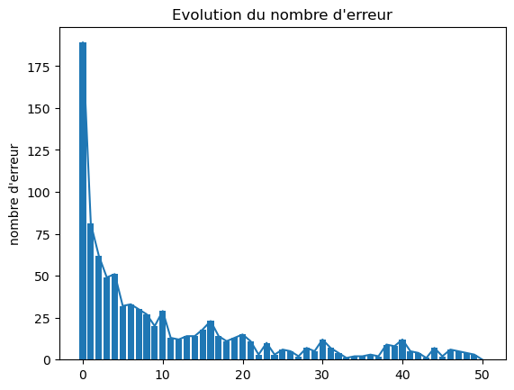

### Rapport TD3 - OCR
#### Réalisé par : Romain Duc
```
 nombre d'erreurs = [189, 81, 62, 49, 51, 32, 33, 30, 27, 20, 29, 13, 12, 14, 14, 18, 23, 14, 11, 13, 15, 11, 3, 10, 3, 6, 5, 2, 7, 5, 12, 7, 4, 1, 2, 2, 3, 2, 9, 8, 12, 5, 4, 1, 7, 2, 6, 5, 4, 3, 0]
```

au bout de 40-50 epochs, le nombre d'erreurs est de 0.


Jeu de données fournies :
```
exemple à reconnaitre : 
██  ██  ██
████    ██
    ██  ██
██    ████
██      ██
exemple reconnu : 
██      ██
████    ██
██  ██  ██
██    ████
██      ██
Nombre de modifications asynchrones :  2
Indices des éléments modifiés en asynchrone :  [2, 10]
```